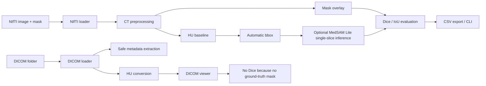
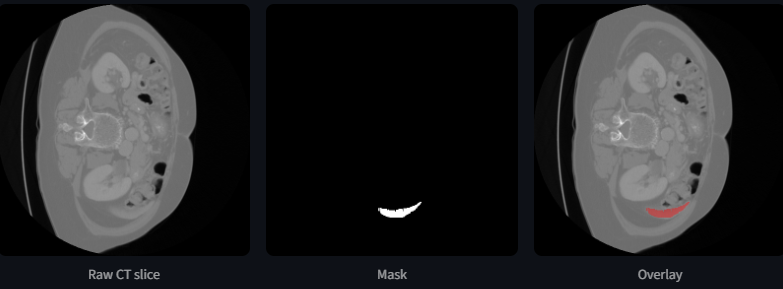
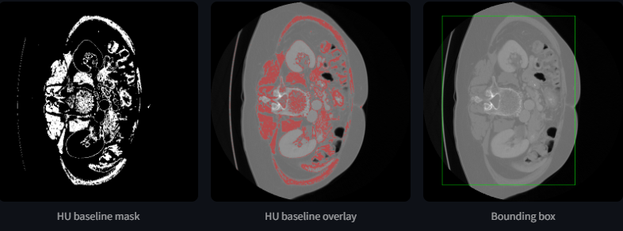
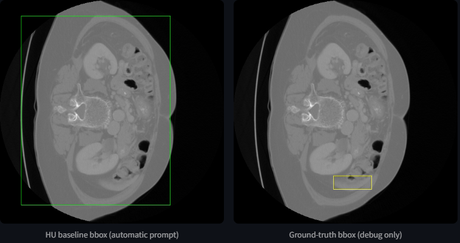
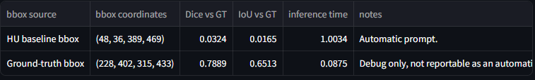
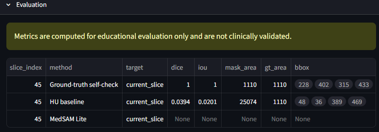
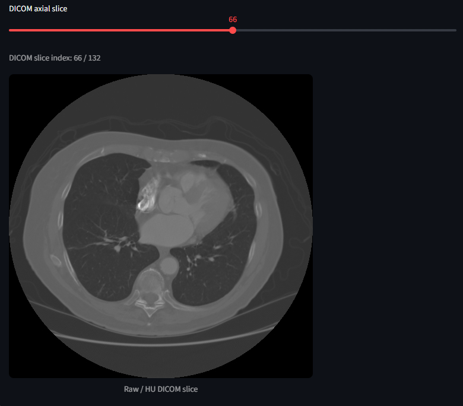

# Liver CT Foundation Segmentation


A local medical imaging pipeline for liver CT segmentation using NIfTI/DICOM ingestion, Hounsfield windowing, HU baseline prompting, MedSAM Lite single-slice inference, Streamlit visualization and Dice/IoU evaluation.

> Educational project only. Not for clinical use or diagnosis.

## Overview

This project demonstrates a practical local workflow for liver CT segmentation experiments. It combines medical image ingestion, CT preprocessing, interactive visualization, simple baseline prompting, optional MedSAM Lite single-slice inference and transparent evaluation.

The objective is not to propose a new segmentation architecture, but to demonstrate the integration of medical imaging preprocessing, foundation-model inference, DICOM/NIfTI handling, and transparent evaluation in a local research pipeline.

## Why this project?

Foundation models for medical imaging are sensitive to input preparation, prompt quality and evaluation design. This repository focuses on those engineering details rather than presenting an overclaimed end-to-end clinical system.

The current implementation is useful for:

- inspecting liver CT NIfTI volumes and masks locally;
- comparing raw CT display with liver-windowed CT display;
- generating a naive HU baseline and automatic 2D bounding box;
- running optional MedSAM Lite inference on one selected slice when local weights are available;
- comparing automatic and debug bounding box prompts transparently;
- exporting educational Dice/IoU metrics for reproducible local checks.

## Key features

- NIfTI image and mask loading with metadata display
- Streamlit axial slice viewer
- Mask overlay and mask diagnostics
- CT Hounsfield windowing and basic HU statistics
- Naive HU-threshold liver baseline
- Automatic 2D bounding boxes
- Optional MedSAM Lite real single-slice inference with local weights
- MedSAM bbox source comparison
- Dice, IoU, area, bbox coverage and CSV export
- Simple local DICOM CT viewer with safe metadata extraction
- Lightweight CLI for local inspection and evaluation
- Unit tests for core loading, preprocessing, metrics, baseline, DICOM and MedSAM wrapper behavior

## Architecture



See [docs/architecture.md](docs/architecture.md) for a more detailed view.

## Dataset

No medical data is included in this repository.

Use local CT data only, such as a NIfTI image and compatible mask pair from a public research dataset. Medical data, generated masks, outputs and checkpoints must not be committed to Git.

Expected NIfTI inputs:

- CT image volume: `.nii` or `.nii.gz`
- matching mask volume: `.nii` or `.nii.gz`
- same 3D shape for image and mask
- liver label defaults to `1`

## Pipeline

1. Load NIfTI CT image and optional mask.
2. Inspect metadata, spacing, dtype and intensity statistics.
3. Browse axial slices in Streamlit.
4. Display raw or liver-windowed CT slices.
5. Display target-label or all-nonzero mask overlays.
6. Run a naive HU baseline on the current slice.
7. Generate a 2D bbox from the baseline or, for debug only, from the mask.
8. Optionally run MedSAM Lite on the selected slice with local weights.
9. Compare Dice/IoU metrics against the uploaded ground-truth mask.
10. Export current-slice metrics to CSV.

## Streamlit demo

### NIfTI viewer



### HU baseline and automatic bbox



### MedSAM bbox comparison



### MedSAM comparison results



### Evaluation metrics



### DICOM viewer



If these images are missing in a fresh clone, place screenshots under `docs/screenshots/` using the filenames shown above.

## Results

Real MedSAM Lite single-slice inference was observed locally with CUDA on an NVIDIA GeForce RTX 3050 Laptop GPU.

These are preliminary single-slice results, not dataset-level validation.

| Prompt source | Usage | Dice | IoU | Notes |
|---|---|---:|---:|---|
| HU baseline bbox | Automatic prompt | 0.0324 | 0.0165 | Coarse bbox, weak MedSAM segmentation |
| Ground-truth bbox | Debug only | 0.7889 | 0.6513 | Not reportable as automatic result |

Ground-truth bounding boxes are used only as a debugging control and must not be reported as automatic results.

The comparison shows that MedSAM Lite can produce meaningful segmentation when prompted with a high-quality bounding box, while the current HU baseline prompt is too coarse and significantly degrades performance.

## Bounding box quality analysis

MedSAM Lite performance is highly sensitive to bounding box quality.

The current automatic prompt is generated by a simple HU-threshold baseline. This baseline is intentionally naive: it can include vessels, nearby organs and other soft tissues in the same intensity range. As a result, the generated bbox may be too broad for reliable MedSAM prompting.

The ground-truth bbox mode exists only to debug the pipeline and estimate the effect of prompt quality. It is not an automatic result and should not be used as evidence of deployed segmentation performance.

## DICOM support

The DICOM workflow is intentionally simple and local. It can:

- load a folder containing one CT DICOM series;
- sort slices into a 3D volume;
- apply `RescaleSlope` and `RescaleIntercept` when available;
- display raw/HU and liver-windowed slices;
- show safe metadata without patient identifiers.

DICOM evaluation is not enabled because this branch does not include a matching ground-truth mask.

## CLI usage

```powershell
python scripts/cli.py --help
python scripts/cli.py run-viewer
python scripts/cli.py inspect-nifti --image data/raw/nifti/imagesTr/liver_0.nii.gz --mask data/raw/nifti/labelsTr/liver_0.nii.gz
python scripts/cli.py inspect-dicom --dicom-dir data/raw/dicom/sample_series
python scripts/cli.py evaluate-nifti --image data/raw/nifti/imagesTr/liver_0.nii.gz --mask data/raw/nifti/labelsTr/liver_0.nii.gz --label 1
```

## Installation

Windows with Python 3.11 is recommended for the optional CUDA workflow. Python 3.10 is also supported for the core project.

```powershell
python -m venv .venv
.\.venv\Scripts\activate
python -m pip install --upgrade pip
pip install -r requirements.txt
```

Optional PyTorch CUDA setup is environment-specific. No PyTorch wheel or MedSAM checkpoint is included in this repository.

## Usage

Launch Streamlit:

```powershell
streamlit run app/dashboard.py
```

Then upload:

- a CT image file in `.nii` or `.nii.gz` format;
- a compatible mask file in `.nii` or `.nii.gz` format.

For optional MedSAM Lite inference, place local weights at:

```text
models/medsam_lite/medsam_lite.pth
```

No checkpoint is included, no automatic weight download is performed and weights must not be committed.

## Repository structure

```text
app/                  Streamlit application
src/data/             NIfTI and DICOM loaders
src/preprocessing/    CT windowing and normalization
src/models/           HU baseline and MedSAM wrappers
src/evaluation/       Dice, IoU and metrics export
src/visualization/    Overlays and bounding boxes
scripts/              CLI entrypoints
docs/                 Documentation
docs/screenshots/     README images
data/                 Local data ignored by Git
models/               Local checkpoints ignored by Git
outputs/              Generated metrics ignored by Git
tests/                Unit tests
```

## Limitations

- Educational / portfolio project only.
- Not clinically validated.
- Not for diagnosis.
- Current MedSAM results are preliminary and single-slice only.
- No full-volume MedSAM inference.
- No batch inference.
- No fine-tuning.
- The HU baseline is naive and often produces coarse bounding boxes.
- Ground-truth bbox is debug only and not an automatic result.
- No dataset-level validation yet.
- DICOM support is simple and may not cover all vendor-specific edge cases.
- No PACS integration.
- No DICOM-SEG export.
- No cloud deployment.

See [docs/limitations.md](docs/limitations.md) for the full limitation list.

## Future work

Improving the automatic prompt generation is the main next technical step. The current results show that MedSAM Lite is functional, but the segmentation quality is limited by the coarse HU baseline bounding box.

Planned improvements:

- improve automatic bounding box generation;
- replace the naive HU-threshold baseline with a more robust liver localization method;
- add connected-component filtering and anatomical constraints;
- test multi-slice consistency to stabilize prompts;
- evaluate on multiple MSD liver cases, not only one selected slice;
- compare HU baseline bbox, refined automatic bbox and debug bbox;
- investigate better preprocessing for MedSAM Lite input;
- add optional volume-level inference only if hardware allows;
- add DICOM-SEG export as a future clinical interoperability extension;
- add expert review / clinical validation only in a proper medical setting.

