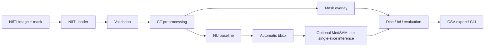
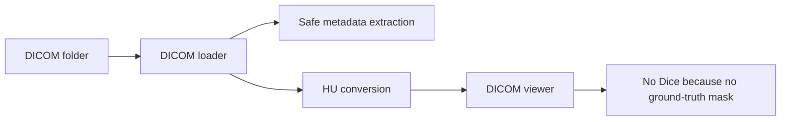

# Architecture

This project is a local research pipeline for liver CT segmentation experiments. It keeps the NIfTI evaluation path separate from the DICOM visualization path so that metrics are only computed when a ground-truth mask is available.

## NIfTI segmentation workflow

The NIfTI path supports quantitative evaluation because the image and mask are uploaded together. Current metrics are computed on the selected slice unless a CLI command explicitly runs a supported evaluation workflow.

## DICOM visualization workflow

The DICOM path is intentionally limited to local loading, safe metadata display and slice visualization. It does not infer or export DICOM-SEG objects.

## Component map

- `app/`: Streamlit dashboard and UI components.
- `src/data/`: NIfTI and DICOM loading utilities.
- `src/preprocessing/`: CT windowing, normalization and slice helpers.
- `src/models/`: HU baseline and MedSAM Lite wrapper.
- `src/prompting/`: bounding box helpers.
- `src/evaluation/`: Dice, IoU, mask statistics and CSV export.
- `src/visualization/`: overlays and bbox drawing utilities.
- `scripts/`: CLI entrypoints.
- `docs/`: project documentation and screenshots.

## Design boundaries

- MedSAM Lite inference is optional and local-only.
- MedSAM Lite inference is single-slice only in the Streamlit workflow.
- Ground-truth bbox mode is debug only and is not an automatic result.
- Medical data, generated outputs and model weights are ignored by Git.
