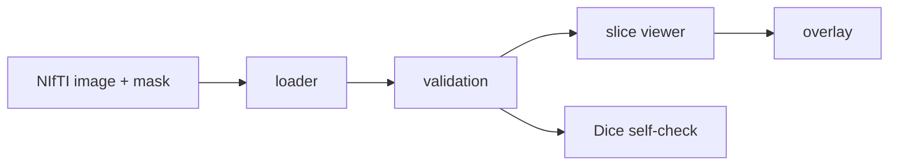

# Architecture

Phase 1 implements a local NIfTI viewer and Dice self-check for liver CT segmentation masks.

Future phases will add CT windowing, baseline segmentation, bounding boxes, MedSAM Lite inference, DICOM ingestion and CLI workflows.
